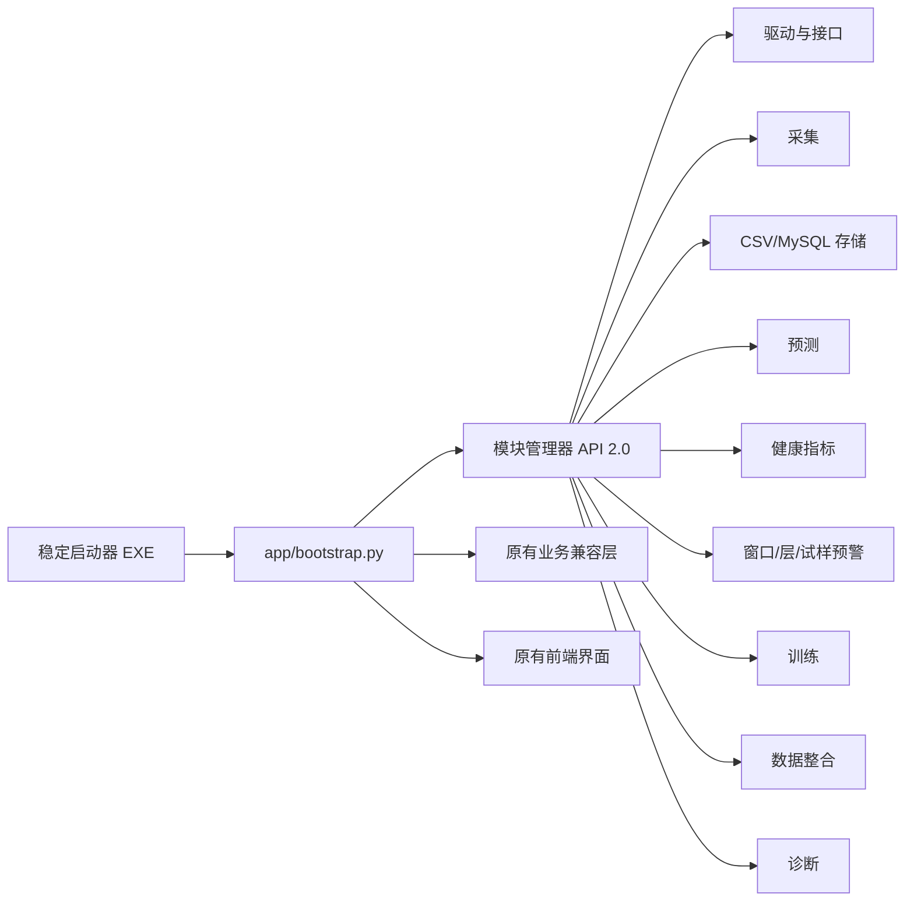

# AFP 一体化系统模块化、Git 维护与发布方案

## 1. 改造目标

本次改造不改变原有采集、预测、健康指标、三级预警、MySQL、数据整合和模型训练的前端使用方式。核心目标是把“每次改一处功能都重新打包整个 EXE”改为“稳定启动器 + 外置业务模块”：一般业务修改只替换对应模块并重启软件，只有基础运行环境发生变化时才重新生成 EXE。

发布软件位于 `delivery/AFP_Integrated_System_Modular_v2.0.0`。其中 `AFP_Integrated_System_Modular.exe` 只负责装载运行环境和外部入口；业务代码、界面、配置、模型与硬件 DLL 均保留在软件目录内的独立位置。

## 2. 总体结构



目录职责如下：

| 位置 | 作用 | 一般修改后是否重打 EXE |
|---|---|---|
| `app/modules/drivers` | 串口、HID、TCP、ABB、UVC、压力模块等驱动适配 | 否 |
| `app/modules/acquisition` | 真实/模拟采集、多接口与通道映射、铺层保存 | 否 |
| `app/modules/storage` | CSV、MySQL、外键、索引和关系视图 | 否 |
| `app/modules/prediction` | 模型目录、权重匹配、因果在线预测 | 否 |
| `app/modules/health` | TC-HI 及其它健康指标 | 否 |
| `app/modules/warning` | 窗口级、层级、试样级聚合和异常类型 | 否 |
| `app/modules/training` | CSV/MySQL 导入、预测/预警联合训练 | 否 |
| `app/modules/data_integration` | 采集文件夹或数据库整合为统一 CSV | 否 |
| `app/modules/diagnostics` | 模块状态、兼容性和现场诊断 | 否 |
| `app/legacy` | 已验证原系统的兼容业务实现 | 否 |
| `app/ui` | 原有采集、预测、预警和训练界面 | 否 |
| `config/runtime.json` | 路径、界面尺寸和模块 API 配置 | 否 |
| `models` | 旧/新数据及不同算法权重 | 否 |
| `native_dll`、`_internal` | 原生 DLL、Python、PyTorch、pywebview 等基础运行时 | 是 |

## 3. 模块契约与数据流

模块 API 版本固定为 `2.0`。采集、预测和预警分别使用统一的 `SampleFrame`、`PredictionFrame` 与 `HealthEvidence` 数据契约，防止某个模块修改字段后静默破坏其它模块。模块通过 `module.json` 声明编号、版本、依赖与能力，启动时按照依赖顺序装载并执行健康检查。

业务数据流保持为：

```text
传感器接口/模拟源 → 通道映射 → SampleFrame → 实时预测 → PredictionFrame
→ 健康特征与异常分数 → HealthEvidence → 窗口级 → 层级 → 实际铺层数试样级
→ CSV/MySQL 保存与数据整合 → 训练中心复用
```

## 4. Git 维护规则

- `main` 仅保存已经确认的稳定源码。
- 当前模块化开发分支为 `feature/modular-runtime-v2`。
- 每个缺陷或模块改动使用单独提交，提交信息说明“改了什么”和“为什么”。
- 进入候选发布时使用 `release/v2.x`，验收后建立版本标签。
- 原始采集数据、个人数据库、日志、训练权重、生成的 EXE 和压缩包不直接提交源码历史；完整 Windows 软件与权重应放到 GitHub Release。
- 修改前先提交或建立分支；修改后依次执行单元测试、模块健康检查、软件自检和对应业务链路测试。

本机 Git 安装位置为 `F:\software\Git`。开发者可使用 `F:\software\Git\cmd\git.exe`，普通软件使用者不需要安装 Git。

## 5. 独立更新与回滚

`scripts/create_module_patch.py` 可把两次 Git 提交之间发生变化的模块、界面或配置制作成补丁 ZIP。软件安装补丁时执行以下步骤：

1. 校验补丁 API 版本；
2. 拒绝绝对路径、父目录跳转和越界文件；
3. 校验每个文件的 SHA-256；
4. 备份原文件；
5. 使用临时文件和原子替换完成更新；
6. 任一文件失败时立即恢复本次已替换的全部文件；
7. 成功更新后可使用最近一次快照回滚。

常用诊断参数：

```powershell
AFP_Integrated_System_Modular.exe --module-status
AFP_Integrated_System_Modular.exe --self-test
AFP_Integrated_System_Modular.exe --verify-files
AFP_Integrated_System_Modular.exe --reload-module health
AFP_Integrated_System_Modular.exe --install-patch 更新包.zip
AFP_Integrated_System_Modular.exe --rollback
```

由于发布程序是无控制台桌面软件，上述命令的结果同时写入 `runtime/*_result.json`，便于现场查看和远程排查。

## 6. 何时仍需重新打包

下列变化才需要重新生成 EXE：Python 或 PyTorch 版本改变、增加打包环境中不存在的第三方库、增加新的原生 DLL 依赖、修改 pywebview/PyInstaller、改变图标或签名、破坏模块 API 兼容性。普通 Python 业务逻辑、HTML/CSS/JavaScript、SQL、健康指标公式、模型权重和配置修改均不需要重新打包。

## 7. 其它电脑部署

复制或解压完整的 `AFP_Integrated_System_Modular_v2.0.0` 文件夹后直接运行 EXE；必须保持 `_internal`、`app`、`config`、`models` 和 `native_dll` 与 EXE 的相对位置不变。目标电脑不需要另装 Python、PyTorch 或 Git。MySQL 只有在选择数据库保存/读取时才需要可访问的 MySQL Server；真实传感器仍需要设备驱动、端口权限和现场通信参数正确。
